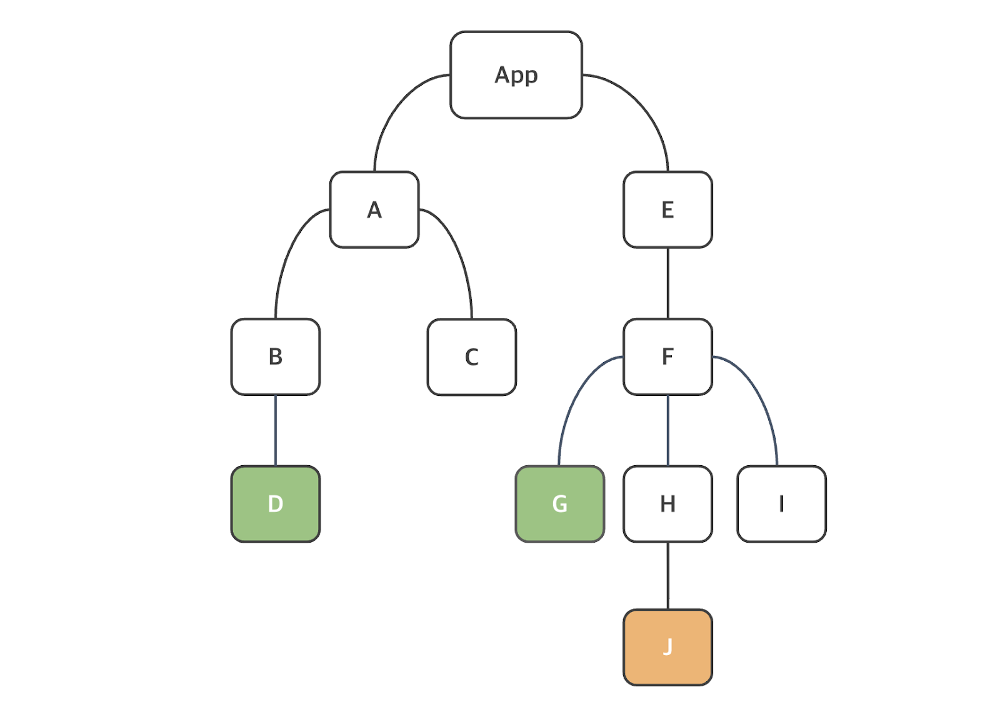

##  상태(State)
- 상태란 시간의 변화에 따라 변경될 수 있는 정보를 보관하는 내부 데이터 저장소.
- 컴포넌트의 렌더링에 영향을 줄 수 있음(그렇다면 값이 바뀌더라도 렌더링에 영향을 주지 않는 것도 있다는 의미.)
- 상태가 업데이트 되면 컴포넌트의 리렌더링을 예약하고, 컴포넌트가 렌더링이 되면 최신 값을 유지하는 성격.
- 상태는 컴포넌트가 사용자 상호작용이나 기타 이벤트에 동적으로 반응할 수 있도록 해줍니다.

상태는 useState 훅 함수를 이용하여 만들 수 있다. 이 함수는 상태의 초기값인 argument를 하나 받고, 두 element로 구성된 배열을 반환한다. 첫 번째 arguement는 상태의 이름이고, 두 번째 arguement는 상태의 값을 업데이트하는 데 이용하는 함수다.
형식
```jsx
// const 선언하고 초기화
const [ state, setState ] = useState(initialValue);

// 이름이 name 이고 초기값이 김일인 상태 변수를 생성한 예시
const [ name, setName ] = useState('김일');
// 나이를 하고 싶다면
const [ age, setAge ] = useState(35); // <- number
// 객체도 들어갈 수 있습니다.
const [ user, setUser] = useState(
  {
    name : '김삼',
    age : 20
  }
);
console.log(user.name); // 결과값 : 김삼
// 김일에서 김이로 바꾸고 싶다면
setName('김이');
setAge(21);
setUser(
  {
    name : '김사',
    age : 12
  }
);
```
이상의 setter 개념을 이용해서 업데이트를 한다고 생각했을 때, 여러분이 만약에 name = '김이'; 와 같이 = 연산자를 통해서 상태를 변경하면 (즉, 값을 제대입하면) 안될까
setter를 경유하지 않으면 컴포넌트의 렌더리링 일아나지 않습니다.

```jsx
 name = '김칠';
// 이상의 경우 UI가 렌더링 되지 않음
```

상태가 여러 개인 경우 useState를 여러 번 호출할 수 있습니다.
```jsx
const [ firstName, setFirstName ] = useState('일')
const [ lastName, setLastName ] = useState('이')

setFristName('이');
setLastName('박');

const [ username, setUsername] = useState('');
const [ email, setEmail ] = useState('');
```

```jsx
const [ name, setName ] = useState({
  fristName : 'Jim';
  lastName : 'Palmer';
});
```
이상의 useState의 초기값이 JS의 객체인 경우, setName을 사용하게 됐을 때 firstName인 Jim을 Josh로 바꾸고 싶다고 하더라도, lastName까지 전부 다 바꿔줘야만 합니다.

```jsx
// Jim을 Josh로, firstName만 바꾸고 싶다
setName({
  firstName : 'Josh';
  lastName : 'palmer';
})
// 로 꼭 lastName을 적어줘야 합니다.
```
즉 현재까지의 상황에서는 객체의 부분 업데이트가 불가능한 상황입니다.
그래서 객체의 부분 업데이트를 수행하려는 경우 저희는 `스프레드(Spread) 연산자` 를 이용한 문법을 사용할 수 있습니다.
```jsx
setName({ ...name, firstName: 'John'})
```
이상에서 ...name이 스프레드 연산자에 해당합니다. ES2018에 도입된  객체 스프레드 구문으로 이상의 코드는 name 상태 객체를 복제하고, firstName 키의 value를 John으로 업데이트 한 사례입니다.

...name 의 해석 -> firstName: 'Josh', lastName : 'Palmer'라고 보면 됩니다.
setName({
  // ...name 부분 그대로 씀.
  firstName : 'John',
  lastName : 'Palmer',
  // 그리고 업데이트 되는 부분
  firstName : 'John'
})
라고 해석할 수 있다.

console.log(name.firstName); 을 하게 되면 Josh 가 아니라 John으로 출력이 된다는 의미입니다.

```jsx

//App.jsx
function App() {
  return(
    <Header>
  )
}

// HeaderText.jsx
function MyComponent() {
  const [firstName, setFirstName] = useState('수림');

  return <div>안녕하세요, {firstName}</div>;
}
```
# 상태 비저장 컴포넌트(Stateless Componenet)
리엑트의 상태 비저장 컴포넌트는 Prop을 arugment 로 받아 리액트 요소를 반환하는 순수 JS 함수입니다.
```jsx
function HeaderText(props) {
  return(
    <h1>
      {props.text}
    </h1>
  );
}

export default HeaderText;
```
이상의 예제 컴포넌트는 순수 컴포넌트(Pure Component)라고도 하는데, 동일한 입력값이 주어졌을 때 일관되게 동일한 컴포넌트를 순수 컴포넌트라고 한다. 리액트는 순수 컴포넌트의 성능을 최적화하는 React.memo() 제공하는데, 다음 코드에서는 컴포넌트를 memo() 안에 포함했다.

```jsx
import {memo} from

function HeaderText(props) {
  return(
    <h1>
      {props.text}
    </h1>
  );
}

export default memo(headerText);
```
이상의 memo() 메서드를 사용한 차이만 있을 뿐인데, 이경우 컴포넌트가 렌더링이되고 memoization됩니다. 이렇게 하면 props의 값이 바뀌지 않으면 이미 메모된 부분을 렌더링 하고, 값이 바뀌면 바뀐 부분을 참조해서 렌더링합니다. 즉 매번 참조를 하지 않아도 되기 때문에 성능상에서는 이점이 있습니다.

## 조건부 렌더링

조건문을 이용하여 true / false 일 때 서로 다른 UI를 렌더링하는 것도 가능합니다. 이 기능은 일부 요소를 표시하거나 숨기고 인증을 처리하는 등의 작업에  이용 가능합니다.
예를 들어 props.isLoggedIn이 true인지 확인하고 true 라면 `<Logout />` 컴포넌트를 렌더링하고, 그렇지 않으면 `<Login />` 컴포넌트를 렌더링하는 사례입니다. 이 경우 두 개의 개별 return 문을 사용해야 합니다.

```jsx
function MyComponent(props) {
  // 지역 변수 선언 및 초기화
  const isLoggedin = props.isLoggedin;
  if(isLoggedin) {  // 이 코드를 봤을 때 isLoggedin의 자료형은 boolean
    return(
      <Logout />
    )
  }

  return (
    <Login />
  )
};
```
혹은 Java 때 배웠던 삼항 연산자를 사용할 수도 있을 겁니다.

```jsx
function MyComponent(props) {
  const isLoggedin = props.isLoggedin;
  return(
    <>
      { isLoggedin ? <Logout  /> : <Login /> }
    </>
  );
}
```

## React Hook
Hook 개념은 React v16.8에 도입되었으며, 이를 이용하며 함수 컴포넌트에서 상태와 리액트의 다른 기능들을 사용할 수 있다. Hook 이전에는 컴포넌트 로직이 필요한 경우 클래스 컴포넌트를 작성해야 했었는데 이제는 함수 컴포넌트 사용이 가능합니다 (월요일 수업에 class , extends, 등 부분들을 의미 이제는 잘 사용 안 함.)

### Hook을 이용하는 데는 중요한 규칙이 있다.
1. 함수 컴포넌트의 최상위 수준에서 훅을 호출해야 함(반복무느 조건문, 중첩 함수 내에서 호출하는 것은 안됨).
2. 훅 이름은 use가 사용됨.

### useState

ch2 내에 새로운 프로젝트 생성
hooklesson / React / JavaScript
npm install / npm run dev를 해서 default vite/react 프로젝트 화면을 띄워주시오.

지시 사항
1. App2.jsx 만들어서 App.jsx에 있는 거 전부다 복붙, App.jsx는 초기화
2. src 폴더 내에 componets 폴더 생성
3. componenets 폴더 내에 Counter.jsx 파일 생성

버튼을 포함하고, 버튼을 누르면 카운터가 1씩 증가하는 예제를 만들 예정

1. Counter 컴포넌트를 생성하고 ,초기값이 0인 상태를 선언. 카운터 상태의 값은 setCount 함수를 이용하여 업데이트
```jsx
// Counter.jsx
function Counter() {

  const [ count, setCount ] = useState(0);

  return(<></>);
}
export default Counter;
```

2. 상태를 1씩 증가시키는 버튼 요소를 렌더링할겁니다. `onClick` 이벤트 속성을 이용하여 setCount 함수를 호출하고 새 값은 현재 값에 1을 더한 값을 설정할겁니다. 카운터 상태 값도 렌더링할겁니다.

```jsx
import { useState } from "react";


export default function Counter () {
  const [ count, setCount ] = useState(0);

  return (
  <div>
    <p>Counter = {count}</p>
    <button onClick={() => setCount(count + 1)}>
        증가
    </button>
  </div>
  );
}
```
아까
<button onClick={setCount(count + 1)}>
     증가
</button>
라고 작성 했을 때 오류가 발생했었습니다.
함수는 이벤트핸들러(여기서는 onClick)에 전달되어야 하며, 사용자가 버튼을 클릭할 때만 리액트가 함수를 호출한다는 점을 명심하셔야 합니다. 이벤트 핸들러 안에서 함수를 호출하면 컴포넌트가 렌더링될 때 함수가 호출되어 무한 루프가 발생할 수 있습니다. 

잠재적으로 화살표 함수를 적용한
onClick(() => setCount(count+1))을 하더라도 문제가 생길 수 있습니다.
상태의 업데이트는 비동기적으로 이루어지기 때문에(즉 컴포넌트가 렌더링 될 때 화명상에 바뀌기 때문에), 새 상태 값이 현재 상태값에 따라 달라질 수 있습니다
(그래서 클릭을 다섯 번 했는데 +1만 이루어질 수도 있습니다). 그래서 한 번 클릭했을 때 +1이 일어나는 것을 담보하기 위해서는
```jsx
<button onClick={() => setCount(prevCount => prevCount + 1 )}>
```

그래서 이상과 같이 작성한 것이 최종 버전으로 이전 값이 setCount 함수에 전달되고, 업데이트된 값이(즉 함수 호출이 끝나고 나서) return 되어 count 상태에 대입됩니다.

### 일괄 처리(Hetching)
리액트는 상태 업데이트에서 일괄 처리를 이용하여 리렌더링을 줄입니다.
버전 18 이전에는 일괄 처리가 버튼 클릭 같은 브라우저 상에서의 이벤트 중에 업데이트 되는 상태에서만 작동했었는데, 버전 18 이후로는 모든 상태 업데이트가 일괄 처리됩니다.

일괄처리의 개념을 위하여
components 폴더 내에 HatchingLesson.jsx를 생성하고 export 시킨 후에 App.jsx 내의 Counter 컴포넌트 위에 위치 시키시오.

그리고 main.jsx에서 App2 컴포넌트는 삭제

```jsx
// HatchingLesson.jsx
import { useState } from "react"

export default function HatchingLesson() {
  const [ count1, setCount1 ] = useState(0);
  const [ count2, setCount2 ] = useState(0);
  
  const increment = () => {
    setCount1(count1 + 1);    // 아직 재 렌더링  되지 않음.
    setCount2(count2 + 1);
    // setCount2() 함수의 호출 이후에 한꺼번에 재 렌더링이 이루어짐.
    // 즉 모든 상태가 업데이트 되고 나서 컴포넌트가 렌더링 된다고 볼 수 있습니다.
  }

  return (
  <>
    <p>현재 카운터 : {count1} | {count2} </p>
    <button onClick={increment}>++</button>
  </>
  );
}
```

### useEffect

- 함수 컴포넌트에서 보조 작업(side-effect)을 수행하는 데 이용할 수 있다. 근데 형식이 좀 어렵게 느껴질 수도 있다.

- 형식 :
```jsx
useEffect(콜백함수, [의존성])
```
주의 사항으로는 두 번째 argument의 자료형이 배열([])이라는 점입니다.
callback 함수 내에는 보조 작업을 위한 로직이 포함되어 있으며, [의존성]은 의존성을 포함하는 _배열_ 로 선택사항이다.

components 폴더 내에 Counter2.jsx 생성 및 함수형 컴포넌트 초기화를 하고,
App.jsx 내에 Counter2 컴포넌트를 가장 상단에 위치

Counter 컴포넌트의 return문을 그대로 복사하고, 오류 처리까지

```jsx
import { useState, useEffect } from "react";

export default function Counter2 () {
  const [ count, setCount ] = useState(0);

  useEffect(() => {
    console.log('useEffect가 호출되었습니다.')
  });

  return (
  <div>
    <p>Counter = {count}</p>
    <button onClick={() => setCount((prevCount) => prevCount + 1 )}>
        증가
    </button>
  </div>
  );
}
```
useEffect를 사용하기 위해 import 문을 수정했었습니다.
버튼을 눌렀을 때 useEffect가 호출되었습니다, 라는 문구가 콘솔에 출력되는데, 그 의미는
Counter2 컴포넌트가 렌더링될 때마다 useEffect 함수가 호출된다는 점입니다.

그런데 useEffect 훅에서는 콜백 함수가 모든 렌더링에서 실행되는 게 아니라, 일부 상황에 맞출 때에만 실행될 수 있도록 통제할 수 있습니다.

그 통제 방식 -> 두 번째 argument인 [dependencies]에 따라 달려있습니다.
예를 들어 count의 상태값이 변결될 때마다(이전 값과 현재 값이 다를 때마다) callback 함수를 호출하고 싶다면 [count]와 같은 방식으로 작성할 수 있습니다.
그리고 dependencies의 자료형이 Array인 만큼, 내부의 element로 복수의 element로 집어넣어 배열내의 어떠한 상태라도 바뀌게 된다면 callback 함수가 호출되게도 할 수 있습니다.

예를 들어 상태 중에
const [ reply, setReply ] = useState('')
const [ like, setLike ] = useState(0);

이라고 가정했을 때

useEffect(() => {
  console.log('좋아요, 혹은 댓글이 달렸습니다.');
}, [like, reply]);
와 같은 방식으로 쓸 수 있다는 의미입니다.

```jsx
  useEffect(() => {
    console.log('useEffect가 호출되었습니다.')
  }, []); 
```
이렇게 작성했을 경우에는 최초 렌더링 시에만 callback 함수가 호출 되고, 나머지의 경우에는 호출되지 않습니다.

그러면 저희는
1. 의존성 배열을 추가하지 않았을 때
  - 버튼 누를 때 마다 callback 함수 호출
2. [count] 를 추가했을 때
  - 버튼 누를 때 마다 callback 함수 호출
3. [] 를 추가했을 때
  - 최초 렌더링 시에만 callback 함수 호출 <- 많이 쓰는 형태

그러면 콘솔창에 찍히기 위해서 useEffect를 쓰냐면 그건 아니고, 보통은 보조 작업 이전에 실행되는 정리 함수(clean-up)를 반환하기 위해서입니다. 지속적으로 상태가 변화하는 타이머나 구독 기능 등으로 인해 예상치 못한 작동을 방지하기 위해서 사용하는 기능입니다.

예시는 Counter2.jsx에 추가

```jsx
  useEffect(() => {
    console.log('useEffect가 호출되었습니다.')
    return () => {
      console.log('clean up 함수가 호출되었습니다.')
    }
  }, [count]);
```
이상의 코드라인을 적용한 후에 실행하면, 초기 렌더링을 하게 되고, 그 이후에 컴포넌트가 DOM에서 제거되고 나서 정리함수가 호출됩니다.
즉 정리 이후에 다시 렌더링이 일어났습니다(StrictMode라서)
그 결과 콘솔창에
useEffect가 호출되었습니다 -> DOM에 컴포넌트 등록시
clean up 함수가 호출되었습니다 -> DOM 에서 Counter2 컴포넌트 제거 시 호출
useEffect가 호출되었습니다 -> StrictMode로 인해 다시 컴포넌트가 DOM에 등록됐을 때 

### useRef

- useRef Hook은 DOM 노드에 접근하는 데 이용할 수 있는 변경 가능한 ref 객체를 반환 
형식
```jsx
const ref = useRef(initialValue)
```
반환되는 ref 객체는 전달된 argumnent로 초기화된 current 속성이 있다.

예제를 통해서 inputRef라는 이름의 ref 객체를 생성하고, null로 초기화할 예정, 그 다음에 JSX 요소의 ref 속성을 이용, ref 객체를 전달. input 요소가 button 요소 내 콜백 함수에 포함되고, current 속성을 이용하여 input 요소의 focus 함수를 실행.

App3.jsx를 만들고, App.jsx의 요소를 전부 붙여넣고, App.jsx는 초기화

### Custom Hook
React 에서는 사용자 정의 Hook 함수를 만드는 것이 가능.
규칙에서 언급한 것처럼 use로 시작해야하며 JS 함수입니다.
사용자 정의 혹은 다른 훅을 호출하는 것도 가능합니다.

예제 과정
1. 문서 제목을 업데이트하는 데 이용할 수 있는 useTitle 훅을 만들 예정(.JS 파일을 만듭니다).useTitle.js라는 파일을 생성

src 내에 js라는 폴더를 만들고 useTitle.js
```js
import { useEffect } from "react"

function useTitle(title) {
  useEffect( () => {
    document.title = title;
  }, [title])
}

export default useTitle;
```
2. 이상과 같이 useEffect 훅을 이ㅣ용하여 title의 arugment가 바뀔 때마다 문서 제목을 업데이트 하도록 작성했습니다.(document.title은 index.html 파일 내에 있는 `<title>` 태그에 해당합니다.)

## Context API 

월요일 수업 때 수업한 내용으로 `상위 컴포넌트`에서 `하위 컴포넌트`로 `props` 전달이 가능하다고 했습니다. 즉 하위 → 상위 컴포넌트로의 전달은 불가능하다는 점도 문제고,  

조부모컴포넌트 → 부모컴포넌트 → 자식컴포넌트 의 3단 구조라고 가정했을 때
조부모 컴포넌트로부터 자식 컴포넌트로 정보를 전달하기 위해서는 부모 컴포넌트에도 전달이 되어야만 합니다.

컴포넌트의 트리가 깊고 복잡하다면 프롭을 이용하여 데이터를 전달하는 것이 번거로울 수 있습니다. 컴포넌트 트리의 모든 컴포넌트들을 통해서 각각 props를 전달해야하기 때문입니다. Context API는 이러한 문제를 해결하기 위해서 전역 데이터를 이용하는 방식을 취합니다.



ctrl + shift + v (preview)

컴포넌트 API를 사용하면 두 번째 그림처럼 여러 컴포넌트에 필요한 _전역 데이터_ 방식으로 관리할 수 있습니다.

컨텍스트는 기본값을 설정하기 위한 argument를 받는 createContext() 메서드로 만들게 됩니다.
형식:
```jsx
const AuthContext = createContext('');

export default AuthContext
```
App4.jsx 만들고 App.jsx 에 있는 거 복붙하고 App.jsx는 초기화
AuthContext.jsx 생성
MyComponent.jsx 생성 하는데 둘 다 components 폴더에 만들기.

```jsx
// AuthContext.jsx
import React from "react";

const AuthContext = React.createContext('');

export default AuthContext;

// MyComponent.jsx
import React from 'react';
import AuthContext from "./AuthContext";

export default function MyComponent() {
  const authContext = React.useContext(AuthContext);

  return(
    <>
      <h1>안녕하세요, {authContext}</h1>
    </>
  );
}

// App.jsx
import AuthContext from './components/AuthContext';
import MyComponent from './components/MyComponent';
import './App.css';

function App() {
  const userName = '김일';

  return (
    <>
    <AuthContext.Provider value={userName}>
      <MyComponent />
    </AuthContext.Provider>
    </>
  );
}

export default App
```

이상의 형태로 코드를 정리하게 됐을 때, AuthContext.jsx에 정의한 내용은 `<AuthContext.Provider>` 로 감싸진 내에 있는 모든 컴포넌트들이 사용할 수 있게 됩니다.
그래서 AuthContext로 이름 지어놧지만 React.createContext()를 사용하게 되면 자동으로 AuthContext.Provider 를 사용할 수 있게 되는데, 이를 컨텍스트 공급자라는 표현으로 사용하기도 합니다. 그리고 그것의 내부 속서응로 value 가 존재하며 여기에 저희는 '김일'을 대입했습니다.

그리고 이를 감쌌기 때문에 MyComponent의 하위 컴포넌트 트리에서 언제나 '김일'을 불러올 수 있게 됩니다. 위에 작성한 코드로는 React.useContext(AuthContext)를 authContext라는 지역 변수에 대입해서 return 문에서 작성했습니다.

대체품으로는 Recoil을 쓸 수 있다.

## 리액트로 목록 처리
- 이를 위해서 알아야하는 것은 JavaScript 에서의 map() 메서드(Java의 Map 자료형이 아님.)
```js
const arr = [1,2,3,4];
const resArr = arr.map(x => x * 2);
console.log(resArr);  // 결과값 [2,4,6,8]
```

이상의 JS 코드를 Java로 보게 되면
```java
int[] arr = {1,2,3,4};
int[] ressArr = new int[4];
for(int i = 0 ; i < arr.length ; i++) {
  ressArr[i] = arr[i] * 2;
}
System.out.println(Arrays.toString(ressArr));
```

componets 폴더에 MyList.jsx 만들고 , App.jsx에 MyList 를 import 하고
AuthContext.Provier 위에다가 MyList 컴포넌트 입력
그리고 이제는 .jsx 파일 만들라고 하면 알아서 export default function MyList() 작성 return 까지

```jsx
export default function MyList() {
  const numbers = [1, 2, 3, 4, 5];
  return (
    <>
      <ul>
        {
          numbers.map((numberm, index) => 
            <li key={index}>배열의 각 element : {number}</li>
          )
        }
      </ul>
    </>
  );
}
```
위에와 같이 정리할 필요가 있습니다. 즉 return문에서 unordered list 태그 numbers 배열의 각 element를 뽑아내서 li 태그에 표시를 할 수 있도록 작성했습니다.
예를 들어 1,2,3,4,5 가 아니라, 10, 20, 30, 40, 50 으로 만들어주려면 어디를 고쳐야할까 ?

단, numbers는 손대지 말고
```jsx
<li key={index}>배열의 각 element : {number*10}</li>
```

* 목록 순서를 바뀌ㅣ나 목록 항목을 추가, 또는 삭제할 경우에 배열 상의 index 넘버가 다 바뀌게 될겁니다. 그러면 `<li key={index}>` 형태는 안정적이라고 볼 수가 없습니다. 
그래서 key에 index를 집어넣는 것은 권장하지 않습니다.

또한 데이터가 객체의 배열이라면 테이블 형식으로 표시할 수도 있습니다.
목록을 처리할 때와 거의 동일하지만 배열을 테이블 행에 매핑하고 테이블 element 내부에 뿌려서 보여주는 방법도 작성하겠습니다

components 폴더에 MyTable.jsx를 만들고
App.jsx의 MyList 위에 MyTable 컴포넌트 삽입 및 코드 처리

```jsx
export default function MyTable() {
  
  const students = [
    {id: 1, name: '김일', mejor: '컴퓨터공학과'},
    {id: 2, name: '김이', mejor: '고분자공학과'},
    {id: 3, name: '김삼', mejor: '패션디자인과'},
  ];
  
  return (
    <>
      <table>
        <tbody>
          {
            students.map(student => 
              <tr key={student.id}>
                <td>{student.name}</td>
                <td>{student.mejor}</td>
              </tr>
            )
          }
        </tbody>
      </table>
    </>
  );
}
```

# .map 메서드의 응용 과제

StudentsList.jsx 만들고
내부의 데이터를 
const students = ['김일', '김이', ...'김십'];

한 뒤에 .map() 메서드를 활용하여
App 컴포넌트에 StudentsList 컴포넌트를 삽입

 